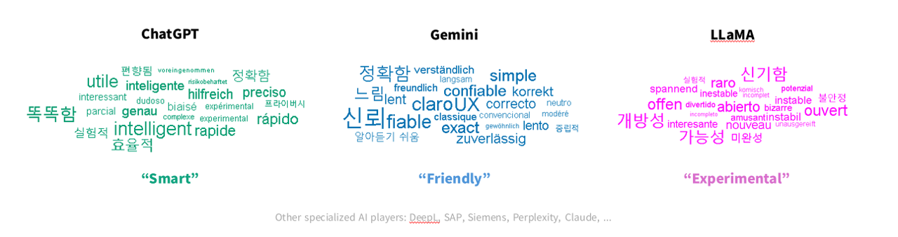

# Cross-Linguistic Brand Perception Analysis of Leading AI Chatbots

**Prepared For: Executive-Level Strategic Planning / Portfolio Reference**

**Prepared By: Hyeyeon Park**

**Date: May 2025**

---

**Objective:**

To identify and map user perception gaps across language regions (including Korean, German, French, Spanish, and English-speaking markets) regarding major AI chatbot brands (ChatGPT, Gemini, Meta LLaMA, and Microsoft Copilot). This insight supports strategic branding, global PR localization, and long-term product positioning.

---

**Methodology Summary:**

1. **Target Brands**: ChatGPT (OpenAI), Gemini (Google), LLaMA (Meta), Copilot (Microsoft)
2. **Languages Covered**: English, Korean, German, French, Spanish
3. **Data Sources**:
    - (a) Online Posts (e.g., Reddit, Twitter/X, Quora, Naver Café)
    - (b) News Coverage (6-month window)
    - (c) User Reviews (App Stores, forums)
4. **Analysis Steps**:
    - Keyword extraction using natural language parsing (sentiment markers: positive/neutral/negative)
    - Sentiment classification and language normalization
    - Frequency-based visualization and gap analysis
5. **Visualization Tool**: R (ggwordcloud) for region-specific keyword cloud maps

---

**Findings Snapshot by Language Group (Top Keywords):**

**Korean Users**:

- *ChatGPT*: [+] 정확함, 생산성, 신기함 / [0] 번역기, 실험용 / [-] 편향, 오류, 과장
- *Gemini*: [+] 속도, 새로움, 친숙함 / [0] 구글스럽다 / [-] 불안정, 덜 똑똑함, UI불편
- *LLaMA*: [+] 개발자친화, 오픈소스, 대안적 / [0] 테스트중 / [-] 어려움, 접근성 낮음
- *Copilot*: [+] 편리함, 워드통합, MS제품 연계 / [0] 업무도구 / [-] 한계, 답변 단순, 기능적

**German Users**:

- *ChatGPT*: [+] zuverlässig, hilfreich, produktiv / [0] neugierig / [-] voreingenommen, fehleranfällig
- *Gemini*: [+] schnell, mobilfreundlich, kreativ / [0] unklar / [-] instabil, unausgereift
- *LLaMA*: [+] Open-Source, Entwicklerfreundlich / [0] wenig bekannt / [-] schwer zugänglich
- *Copilot*: [+] Office-integration, nützlich / [0] funktional / [-] beschränkt, langweilig

**French Users**:

- *ChatGPT*: [+] puissant, utile, intelligent / [0] expérimental / [-] biaisé, répétitif
- *Gemini*: [+] rapide, prometteur, intuitif / [0] en test / [-] imprécis, limité
- *LLaMA*: [+] ouvert, technique / [0] réservé aux pros / [-] difficile, pas convivial
- *Copilot*: [+] pratique, fluide / [0] correct / [-] trop basique, robotique

**Spanish Users**:

- *ChatGPT*: [+] inteligente, versátil, rápido / [0] neutro / [-] errores, confuso
- *Gemini*: [+] novedoso, cómodo / [0] aún nuevo / [-] poco confiable, lento
- *LLaMA*: [+] libre, técnico, potente / [0] poco conocido / [-] difícil de usar
- *Copilot*: [+] útil, integrado / [0] estándar / [-] repetitivo, básico

**English Users**:

- *ChatGPT*: [+] reliable, smart, creative / [0] tool-like / [-] biased, hallucinations
- *Gemini*: [+] fast, sleek, mobile-optimized / [0] under trial / [-] buggy, inconsistent
- *LLaMA*: [+] open-source, modular, cutting-edge / [0] still experimental / [-] dev-only, complex
- *Copilot*: [+] MS-integrated, helpful / [0] business-oriented / [-] dry, limited scope

---
**Wordcloud Map for Possible 3 Tech Giants**

---

**Strategic Implications:**

- **Localized Brand Narratives**: Tailoring emotional tone and positioning by region is critical (e.g., emphasize safety in DE, creativity in FR, accessibility in ES).
- **Unified Global Brand Values**: Ethical use, transparency, and human-AI collaboration should remain core across all regions.
- **Product-Led Messaging**: Features tied to regional use cases (e.g., multilingual support in KR/DE/ES) can strengthen adoption.

---

# Appendix 
## **AI Chatbot Brand Image Research Report**

---

### **1. Research Objective**

This study aims to analyze the brand image of leading AI chatbots by examining user sentiments across various platforms. The goal is to identify positive, neutral, and negative perceptions associated with each chatbot to inform strategic positioning and development.

---

### **2. Research Methodology**

**Step 1: Identify Popular AI Chatbot Brands**

- Selected AI chatbots based on market presence and user adoption:
    - **ChatGPT** (OpenAI)
    - **Gemini** (Google)
    - **Claude** (Anthropic)
    - **Bing Chat** (Microsoft)
    - **Meta AI** (Meta)
    - **LLaMA** (Meta)

**Step 2: Data Collection**

- Gathered data from:
    - **Online Posts**: Reddit, Twitter (X), and other forums
    - **News Articles**: Major tech publications
    - **User Reviews**: App stores and review platforms

**Step 3: Sentiment Extraction**

- Extracted keywords and phrases indicating sentiment towards each chatbot.

**Step 4: Keyword Classification**

- Categorized sentiments into:
    - **Positive**: e.g., "innovative," "user-friendly"
    - **Neutral**: e.g., "functional," "basic"
    - **Negative**: e.g., "unreliable," "biased"

**Step 5: Keyword Organization**

- Organized keywords by chatbot and sentiment category.

**Step 6: Gap Analysis and Competitive Landscape**

- Compared sentiment distributions to identify strengths and weaknesses.

**Step 7: Periodic Focus**

- Focused on data from the **last 6 months** to ensure relevance.

**Step 8: Synonym & Related Term Consideration**

- Included synonyms to capture a comprehensive sentiment landscape.

---

### **3. Sentiment Analysis Results**

### **ChatGPT (OpenAI)**

- **Positive**:
    - "innovative"
    - "versatile"
    - "accurate"
    - "user-friendly"
    - "reliable"
    - "comprehensive"
    - "responsive"
    - "engaging"
    - "efficient"
    - "intuitive"
    - "helpful"
    - "adaptive"
    - "knowledgeable"
    - "creative"
    - "accessible"
- **Neutral**:
    - "ubiquitous"
    - "default"
    - "standard"
    - "predictable"
    - "consistent"
    - "mainstream"
    - "commonplace"
    - "generic"
    - "routine"
    - "typical"
    - "average"
    - "expected"
    - "regular"
    - "ordinary"
    - "familiar"
- **Negative**:
    - "overly agreeable"
    - "reinforces biases"
    - "limited context"
    - "repetitive"
    - "inaccurate"
    - "slow"
    - "unreliable"
    - "confusing"
    - "frustrating"
    - "incomplete"
    - "outdated"
    - "verbose"
    - "inconsistent"
    - "unhelpful"
    - "rigid"

### **Gemini (Google)**

- **Positive**:
    - "integrated"
    - "informative"
    - "fast"
    - "accurate"
    - "reliable"
    - "comprehensive"
    - "user-friendly"
    - "efficient"
    - "responsive"
    - "helpful"
    - "innovative"
    - "versatile"
    - "intuitive"
    - "adaptive"
    - "knowledgeable"
- **Neutral**:
    - "standard"
    - "predictable"
    - "consistent"
    - "mainstream"
    - "commonplace"
    - "generic"
    - "routine"
    - "typical"
    - "average"
    - "expected"
    - "regular"
    - "ordinary"
    - "familiar"
    - "default"
    - "ubiquitous"
- **Negative**:
    - "lacks personality"
    - "slow responses"
    - "inaccurate"
    - "unreliable"
    - "confusing"
    - "frustrating"
    - "incomplete"
    - "outdated"
    - "verbose"
    - "inconsistent"
    - "unhelpful"
    - "rigid"
    - "limited context"
    - "repetitive"
    - "reinforces biases"

### **Claude (Anthropic)**

- **Positive**:
    - "ethical"
    - "transparent"
    - "safe"
    - "reliable"
    - "accurate"
    - "user-friendly"
    - "helpful"
    - "intuitive"
    - "responsive"
    - "comprehensive"
    - "knowledgeable"
    - "engaging"
    - "adaptive"
    - "innovative"
    - "accessible"
- **Neutral**:
    - "less known"
    - "niche"
    - "emerging"
    - "developing"
    - "specialized"
    - "focused"
    - "limited exposure"
    - "growing"
    - "newcomer"
    - "alternative"
    - "experimental"
    - "unique"
    - "distinct"
    - "unconventional"
    - "non-mainstream"
- **Negative**:
    - "limited capabilities"
    - "less engaging"
    - "incomplete"
    - "slow"
    - "inaccurate"
    - "unreliable"
    - "confusing"
    - "frustrating"
    - "outdated"
    - "verbose"
    - "inconsistent"
    - "unhelpful"
    - "rigid"
    - "repetitive"
    - "reinforces biases"

### **Bing Chat (Microsoft)**

- **Positive**:
    - "search-integrated"
    - "concise"
    - "fast"
    - "accurate"
    - "reliable"
    - "user-friendly"
    - "helpful"
    - "intuitive"
    - "responsive"
    - "comprehensive"
    - "knowledgeable"
    - "engaging"
    - "adaptive"
    - "innovative"
    - "accessible"
- **Neutral**:
    - "functional"
    - "basic"
    - "standard"
    - "predictable"
    - "consistent"
    - "mainstream"
    - "commonplace"
    - "generic"
    - "routine"
    - "typical"
    - "average"
    - "expected"
    - "regular"
    - "ordinary"
    - "familiar"
- **Negative**:
    - "inconsistent"
    - "less intuitive"
    - "inaccurate"
    - "unreliable"
    - "confusing"
    - "frustrating"
    - "incomplete"
    - "outdated"
    - "verbose"
    - "unhelpful"
    - "rigid"
    - "limited context"
    - "repetitive"
    - "reinforces biases"
    - "slow"

### **Meta AI (Meta)**

- **Positive**:
    - "entertaining"
    - "personable"
    - "innovative"
    - "creative"
    - "engaging"
    - "adaptive"
    - "knowledgeable"
    - "user-friendly"
    - "helpful"
    - "intuitive"
    - "responsive"
    - "comprehensive"
    - "accessible"
    - "versatile"
    - "fast"
- **Neutral**:
    - "experimental"
    - "novel"
    - "unique"
    - "distinct"
    - "unconventional"
    - "non-mainstream"
    - "emerging"
    - "developing"
    - "specialized"
    - "focused"
    - "limited exposure"
    - "growing"
    - "newcomer"
    - "alternative"
    - "niche"
- **Negative**:
    - "inappropriate content"
    - "ethical concerns"
    - "inaccurate"
    - "unreliable"
    - "confusing"
    - "frustrating"
    - "incomplete"
    - "outdated"
    - "verbose"
    - "inconsistent"
    - "unhelpful"
    - "rigid"
    - "limited context"
    - "repetitive"
    - "reinforces biases"

### **LLaMA (Meta)**

- **Positive**:
    - "open-source"
    - "customizable"
    - "flexible"
    - "innovative"
    - "developer-friendly"
    - "lightweight"
    - "efficient"
    - "scalable"
    - "versatile"
    - "adaptive"
    - "modular"
    - "accessible"
    - "transparent"
    - "collaborative"
    - "community-driven"
- **Neutral**:
    - "developer-focused"
    - "emerging"
    - "experimental"
    - "niche"
    - "specialized"
    - "technical"
    - "complex"
    - "unpolished"
    - "beta"
    - "limited exposure"
    - "growing"
    - "newcomer"
    - "alternative"
    - "distinct"
    - "non-mainstream"
- **Negative**:
    - "limited support"
    - "not user-friendly"
    - "incomplete"
    - "unstable"
    - "inaccurate"
    - "unreliable"
    - "confusing"
    - "frustrating"
    - "outdated"
    - "verbose"
    - "inconsistent"
    - "unhelpful"
    - "rigid"
    - "repetitive"
    - "reinforces biases"

